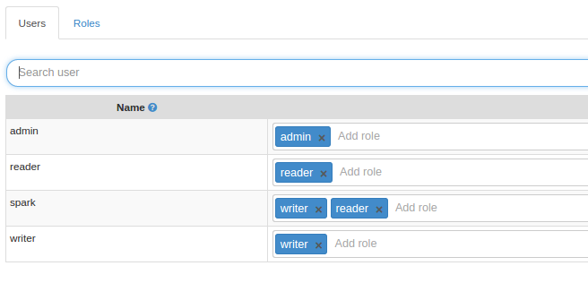
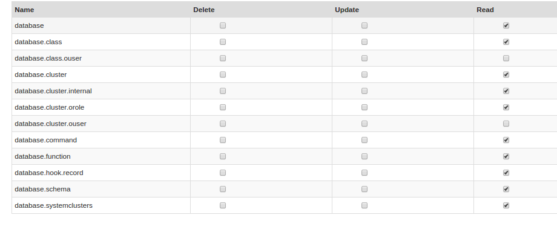

# TextRec

Spark job to store graphs in OrientDB.


## Description

At this point the program just reads some files downloaded from http://wiki.dbpedia.org/Downloads2015-04#titles, 
transform data to a graph (spark-graphX) and store this graph into orientDb

These files contains triples of the form
```
$object rdf:type $class.
```

*Example:*
```
<http://dbpedia.org/resource/Albedo> <http://purl.org/dc/terms/subject> <http://dbpedia.org/resource/Category:Climate_forcing> .
<http://dbpedia.org/resource/Anarchism> <http://purl.org/dc/terms/subject> <http://dbpedia.org/resource/Category:Political_culture> .
<http://dbpedia.org/resource/Anarchism> <http://purl.org/dc/terms/subject> <http://dbpedia.org/resource/Category:Political_ideologies> .
<http://dbpedia.org/resource/Anarchism> <http://purl.org/dc/terms/subject> <http://dbpedia.org/resource/Category:Social_theories> .
<http://dbpedia.org/resource/Anarchism> <http://purl.org/dc/terms/subject> <http://dbpedia.org/resource/Category:Anti-fascism> .
<http://dbpedia.org/resource/Anarchism> <http://purl.org/dc/terms/subject> <http://dbpedia.org/resource/Category:Anti-capitalism> .

```

## Orientdb
*DB version*: 2.1.4 

*link*: http://orientdb.com/wp-content/uploads/2014/05/linux.png

## Orientdb connector

The *jar* is generated from https://github.com/rhernando/spark-orientdb-connector (forked from https://github.com/metreta/spark-orientdb-connector)

To make it work, we have to include orientdb dependencies in *build.sbt* (with the same version of our orientdb instance )

The connector transform a GraphX entity to a OrientDB's graph sctructure and store it. To use it correctly, we should include the desired attributes of each model (Vertex and Edge) into a *case class* (see [RddObj.scala](src/main/scala/com/stratio/orientdb/domain/RddObj.scala)
)

### Notes
In order to make it work with a non-root user, we should create a user an add permissions (read/write). 
We may need to update these permissions to allow this user to access to the cluster meta-info. 






## Run

```
./bin/spark-submit --class com.stratio.rdf.CreateRDFGraph --name RDFOrient --jars rdforient.jar rdforient.jar $ENV $FILES_PATH
```
